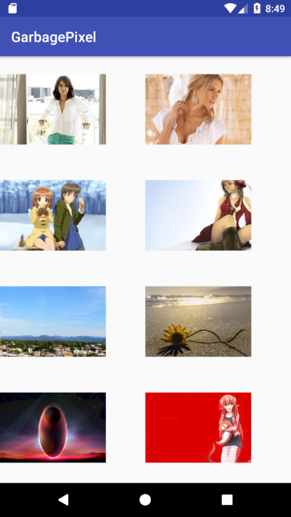

# Garbage Pixel
GarbagePixel正如名字一样 一个 Garbage 的 ImageLoader，用来进行图片的压缩，加载，和缓存。在开发的过程中大量借(chao)鉴(xi)了[Picasso](https://github.com/square/picasso)。项目通过Kotlin语言描述。

欢迎大家提交Bug和PR。

### 运行效果




### 如何使用

```kotlin
Pixel.with(context)
        .from(getItem(position).toString())
        .placeholder(R.drawable.placeholder)
        .error(R.drawable.error)
        .into(holder.imageView)
```

###  添加引用

Add it in your root build.gradle at the end of repositories:

```java
	allprojects {
		repositories {
			...
			maven { url 'https://www.jitpack.io' }
		}
	}
```

**Step 2.** Add the dependency

```java
	dependencies {
	        implementation 'com.github.littledavid-tech:GarbagePixel:1.0RC'
	}
```

### 引用

* [Picasso](https://github.com/square/picasso) 感谢伟大的毕加索框架，让我抄袭
* [LruDiskCache](https://github.com/JakeWharton/DiskLruCache) 提供了磁盘缓存功能的支持